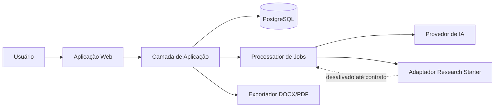

# Arquitetura do projeto

## 1. Visão geral

O Mapa da Pesquisa será uma aplicação web responsiva, organizada como monólito modular no MVP. Essa abordagem reduz custo operacional e complexidade sem impedir a separação futura de geração, exportação ou integrações em serviços independentes.

## 2. Stack confirmada

- Aplicação web: Next.js com App Router e TypeScript.
- Interface: React, componentes acessíveis e CSS utilitário.
- API: Route Handlers/Server Actions com contratos validados.
- Persistência: PostgreSQL gerenciado pelo Supabase, com migrações versionadas.
- Autenticação: Supabase Auth com e-mail/senha e recuperação de senha.
- Processamento: jobs assíncronos persistidos para geração e exportação.
- Geração por IA: adaptador de provedor, com saída estruturada e validação de schema.
- Documentos: geração server-side de DOCX e PDF.
- Testes: unitários, integração, componentes e ponta a ponta.
- Deploy: Vercel para a aplicação e Supabase para PostgreSQL e autenticação.

A biblioteca cliente, o modelo relacional e as políticas de acesso serão definidos na Change 002. A escolha dos provedores não autoriza deployment de produção antes da Change 006.

## 3. Contexto funcional



## 4. Módulos

### Identidade

Cadastro, login, logout, sessão, recuperação de senha e isolamento de dados por usuário.

### Projetos

Criação, listagem, leitura, edição, exclusão e duplicação de projetos. Exclusão deverá exigir confirmação e ser recuperável no nível definido na Change 002.

### Briefing da pesquisa

Captura de tema opcional, situação-problema, palavras-chave, área do conhecimento e nível acadêmico. Validação ocorre no cliente e no servidor.

### Geração

Orquestra prompts versionados, envia dados mínimos ao provedor, valida a resposta estruturada, registra estado do job e persiste a estrutura somente após validação.

### Editor

Permite editar capítulos e seções, com salvamento explícito e proteção contra perda de alterações. Colaboração e histórico de versões não pertencem ao MVP.

### Exportação

Transforma o conteúdo persistido em DOCX e PDF. A exportação usa apenas dados do projeto, identifica conteúdo gerado e não inventa referências.

### Research Starter

Porta de integração reservada. Até o contrato ser recebido, deverá existir apenas como interface/adaptador inativo, sem endpoints, payloads ou respostas simuladas tratados como reais.

## 5. Modelo de domínio inicial

- `User`: identidade fornecida pelo sistema de autenticação.
- `Project`: id, ownerId, título, tema, situação-problema, palavras-chave, área, nível, status, timestamps e soft-delete opcional.
- `ResearchStructure`: projectId, versão do schema, capítulos estruturados, timestamps.
- `GenerationJob`: projectId, tipo, status, progresso, erro sanitizado, timestamps.
- `ExportJob`: projectId, formato, status, localização temporária/segura, expiração, timestamps.

Relacionamentos e tipos definitivos serão formalizados por migração na Change 002.

## 6. Fluxo principal

1. Usuário autenticado cria um projeto.
2. Preenche e valida o briefing.
3. Solicita geração.
4. O servidor cria um job idempotente.
5. O processador gera e valida uma estrutura tipada.
6. A interface acompanha o progresso e apresenta erro recuperável quando necessário.
7. O usuário edita e salva.
8. O usuário solicita DOCX ou PDF.

## 7. Estados relevantes

- Projeto: `draft`, `ready`, `generating`, `generated`, `failed`, `archived`.
- Job: `queued`, `processing`, `completed`, `failed`, `cancelled`.
- A interface nunca deve apresentar sucesso antes da persistência confirmada.

## 8. Segurança e privacidade

- Autorização por recurso em toda operação server-side.
- Sessões seguras, proteção CSRF conforme o mecanismo escolhido e cookies adequados.
- Rate limiting em autenticação, geração e exportação.
- Segredos somente no ambiente do servidor.
- Logs sem conteúdo integral da pesquisa, tokens ou dados pessoais.
- Validação de entrada, limites de tamanho e saída escapada/sanitizada.
- URLs de exportação temporárias e não enumeráveis.
- Política de retenção e exclusão deverá ser definida antes da produção.

## 9. Observabilidade

- Logs estruturados com correlation ID.
- Métricas de latência, taxa de erro, duração de jobs e falhas por etapa.
- Eventos de auditoria para operações sensíveis, sem armazenar conteúdo desnecessário.
- Monitoramento separado para aplicação, banco e provedores externos.

## 10. Estrutura de pastas planejada

```text
/
├── .specs/
├── app/
│   ├── (auth)/
│   ├── (dashboard)/
│   ├── api/
│   └── layout.tsx
├── components/
│   ├── ui/
│   └── features/
├── modules/
│   ├── auth/
│   ├── projects/
│   ├── research-brief/
│   ├── generation/
│   ├── editor/
│   ├── export/
│   └── research-starter/
├── lib/
│   ├── db/
│   ├── validation/
│   ├── security/
│   └── observability/
├── workers/
├── tests/
│   ├── unit/
│   ├── integration/
│   ├── e2e/
│   └── fixtures/
├── public/
└── docs/
```

Esta árvore é planejada, não implementada. Pastas serão criadas apenas quando necessárias.

## 11. Decisões e limites

- O MVP não inclui colaboração, histórico, templates por área ou gerenciadores bibliográficos.
- A geração deve produzir estrutura inicial, não conteúdo acadêmico apresentado como fato.
- Referências só entram no produto quando oriundas de fonte verificável.
- Processamento longo não deve bloquear uma requisição HTTP aberta.
- Alterações de stack ou arquitetura exigem registro da decisão na mudança correspondente.

## 12. Premissas a validar

- Idioma inicial: português do Brasil.
- Um projeto possui um único proprietário no MVP.
- E-mail/senha é suficiente para a primeira versão.
- Word significa `.docx`; PDF terá layout acadêmico neutro, não conformidade automática com uma norma específica.
- O provedor de IA e os limites de uso ainda serão escolhidos.
- Requisitos LGPD, termos de uso, retenção e região de dados precisam de decisão antes do piloto.

## 13. Recursos externos confirmados

- Supabase do Mapa da Pesquisa: Project Ref `aeaweherkrqmlqnxsmib`.
- Research Starter: Project Ref `ygmzwfatdbyxvpbuusmy` (fora do escopo e proibido para operações deste repositório).
- A conexão MCP do Mapa deve permanecer limitada pelo parâmetro `project_ref`.
